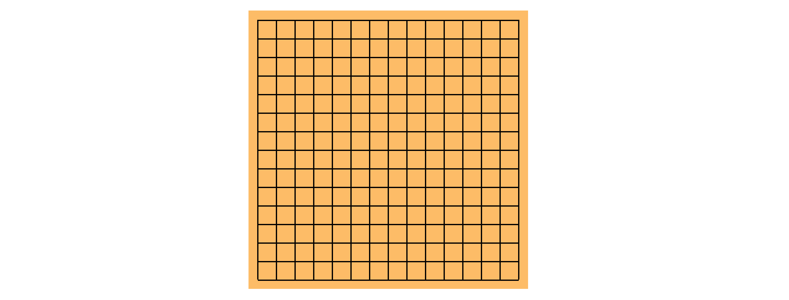
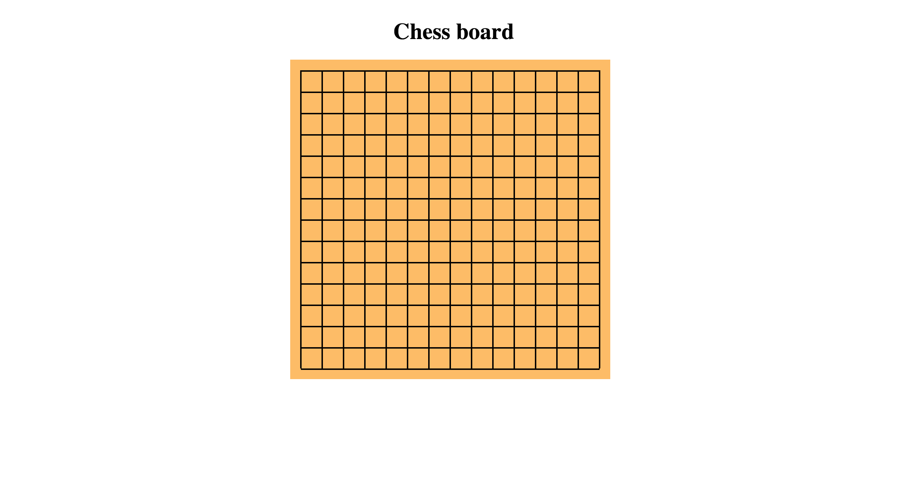

# Go-Bang-Chinese-Chess-Game

It is a simple chess game developed with AngularJs, HTML, CSS.
The Chess board is 15 * 15 shown as following picture, and first 5 continuous same pieces win the game. 

The example looks like the following black, one more black vertically in both direction, black win.

